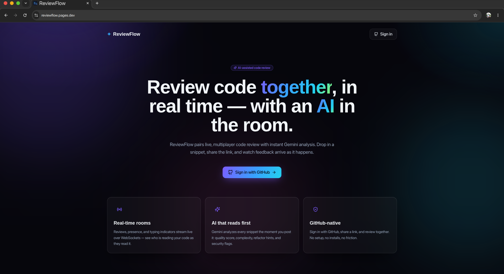
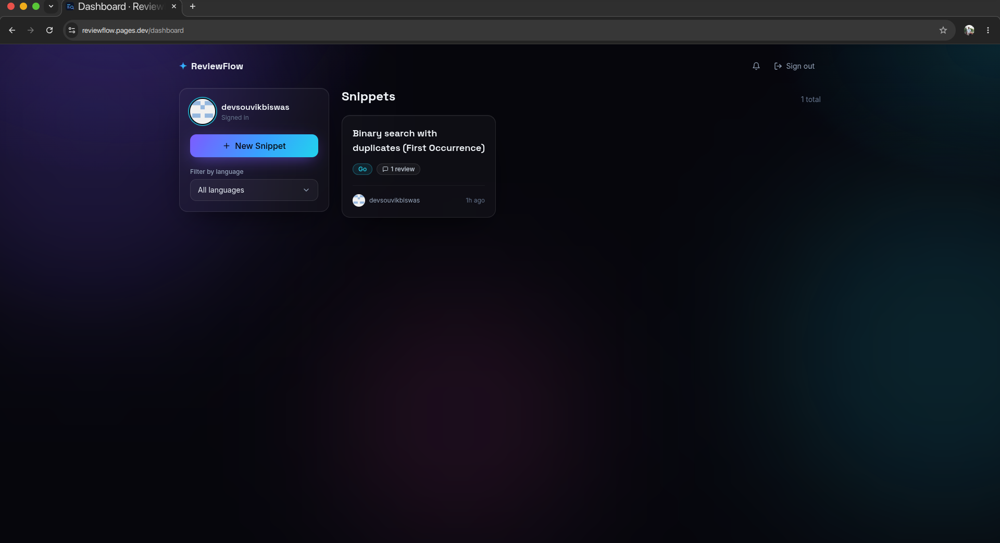
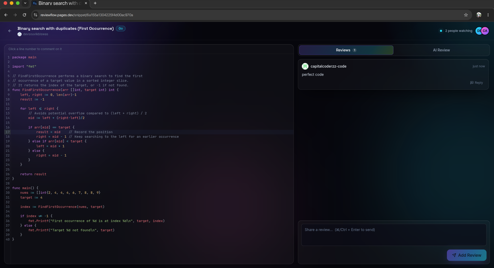
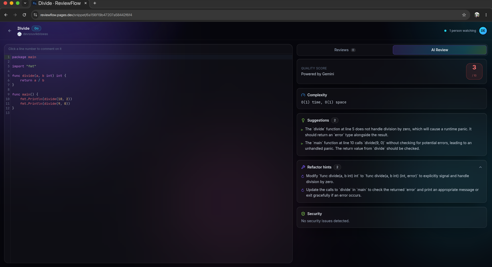
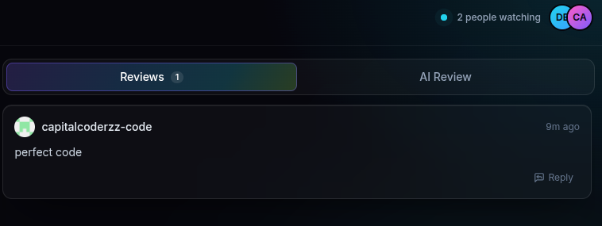

# ReviewFlow

> Real-time, multiplayer code review with an AI in the room.

ReviewFlow is a self-hostable code-review platform: drop in a snippet, share
the link, and watch reviews stream in live while Google Gemini analyses the
code in the background. It pairs a Go (Gin) backend with a Svelte 5 frontend
over GraphQL and a hand-rolled WebSocket hub.

---

## Architecture

```
                ┌───────────────────────────────┐
                │     SvelteKit SPA (Svelte 5)  │
                │  CodeMirror 6 · diff2html     │
                │  urql · native WebSocket      │
                └──────┬───────────────┬────────┘
                       │ HTTPS         │ WSS
                       ▼               ▼
                ┌──────────────────────────────┐
                │       Caddy (edge)           │
                │  · serves SPA               │
                │  · reverse-proxy /graphql,  │
                │    /auth, /ws, /notifications│
                │  · Let's Encrypt, CSP, HSTS │
                └──────────────┬───────────────┘
                               │ http :8080
                               ▼
            ┌──────────────────────────────────────┐
            │   Go backend (Gin + gqlgen)          │
            │  · GraphQL resolvers (snippets,      │
            │    reviews, AI review field)         │
            │  · WebSocket room hub (one Run()     │
            │    goroutine, RWMutex-guarded map)   │
            │  · JWT auth, GitHub OAuth            │
            │  · Notifications REST endpoint       │
            └────┬───────────────────────┬─────────┘
                 │                       │
                 ▼                       ▼
        ┌────────────────┐      ┌──────────────────┐
        │   MongoDB 7    │      │  Gemini 2.0      │
        │   users        │      │  Flash (free)    │
        │   snippets     │      │  · async pipeline│
        │   reviews      │      │  · structured    │
        │   ai_reviews   │      │    JSON output   │
        │   notifications│      │  · rate-limited  │
        └────────────────┘      └──────────────────┘
```

---

## Tech stack

| Layer        | Choice                                                         |
| ------------ | -------------------------------------------------------------- |
| Frontend     | SvelteKit (Svelte 5 runes) · TypeScript · Tailwind CSS         |
| Editor       | CodeMirror 6 · diff2html · jsdiff                              |
| GraphQL      | `@urql/svelte` on the client · `gqlgen` on the server          |
| Realtime     | Native browser WebSocket ↔ `gorilla/websocket` room hub        |
| Backend      | Go · Gin · `golang-jwt/jwt/v5` · `mongo-driver`                |
| AI           | Google Gemini 2.0 Flash via `generative-ai-go`                 |
| Rate limit   | `golang.org/x/time/rate` (10 req/min, under free-tier quota)   |
| Auth         | GitHub OAuth → HttpOnly · SameSite=Strict cookie               |
| Database     | MongoDB 7 (auth enabled in production)                         |
| Edge / TLS   | Caddy 2 — automatic Let's Encrypt                              |
| Packaging    | Docker · multi-stage builds · distroless final image           |

---

## Local development

You only need Docker.

```bash
# 1. Clone, then configure
git clone https://github.com/<you>/reviewflow.git
cd reviewflow
cp .env.example .env

# 2. (recommended) add a GitHub OAuth app + Gemini key
#    GitHub: https://github.com/settings/developers
#      Homepage URL:              http://localhost:5173
#      Authorization callback URL: http://localhost:8080/auth/github/callback
#    Gemini key (free tier):     https://aistudio.google.com/apikey
#    Then edit .env to fill in GITHUB_CLIENT_ID/SECRET, JWT_SECRET, GEMINI_API_KEY

# 3. Start the backend stack (Go + MongoDB, with hot reload via Air)
docker compose up
# -> backend on :8080, /health returns {"status":"ok","db":"connected"}

# 4. In another shell, start the frontend dev server
cd web
cp .env.example .env          # PUBLIC_API_URL=http://localhost:8080
npm install
npm run dev                   # -> http://localhost:5173
```

Open <http://localhost:5173>, sign in with GitHub, create a snippet, and a
Gemini AI review appears moments later.

### Useful commands

| Command                                                    | What it does                                  |
| ---------------------------------------------------------- | --------------------------------------------- |
| `docker compose up`                                        | Backend + MongoDB with hot reload             |
| `cd web && npm run dev`                                    | Frontend dev server (Vite)                    |
| `cd web && npm run check`                                  | TypeScript + Svelte type check                |
| `go vet ./... && go build ./...`                           | Backend type / build check                    |
| `go test ./internal/ai/...`                                | Unit tests for the Gemini parser              |
| `go run github.com/99designs/gqlgen generate`              | Regenerate GraphQL bindings after schema edit |

---

## Environment variables

### Backend (`.env`)

| Variable                | Required | Default                                       | Purpose                                                   |
| ----------------------- | -------- | --------------------------------------------- | --------------------------------------------------------- |
| `PORT`                  |          | `8080`                                        | HTTP port the API listens on                              |
| `ENVIRONMENT`           |          | `development`                                 | Set to `production` for Secure cookies + strict logging   |
| `CORS_ORIGIN`           |          | `http://localhost:5173`                       | Browser origin allowed to call the API + open WebSockets  |
| `MONGO_URI`             | ✓        | `mongodb://mongo:27017`                       | Mongo connection string (use creds in prod)               |
| `MONGO_DB`              |          | `reviewflow`                                  | Database name                                             |
| `JWT_SECRET`            | ✓ (prod) | `dev-insecure-secret-change-me`               | HMAC secret for session tokens (`openssl rand -hex 32`)   |
| `GITHUB_CLIENT_ID`      | ✓        |                                               | GitHub OAuth app id                                       |
| `GITHUB_CLIENT_SECRET`  | ✓        |                                               | GitHub OAuth app secret                                   |
| `GITHUB_REDIRECT_URL`   |          | `http://localhost:8080/auth/github/callback`  | Must match the URL registered on the OAuth app            |
| `FRONTEND_URL`          |          | `http://localhost:5173`                       | Where the browser is sent after a successful login        |
| `GEMINI_API_KEY`        |          |                                               | Gemini API key — when empty, AI reviews are disabled      |

### Frontend (`web/.env`)

| Variable          | Required | Default                  | Purpose                                                                    |
| ----------------- | -------- | ------------------------ | -------------------------------------------------------------------------- |
| `PUBLIC_API_URL`  |          | `window.location.origin` | Backend base URL. In dev set to `http://localhost:8080`; in prod leave it blank — the SPA and API share a host behind Caddy. |

### Production extras (`.env.prod`)

| Variable                                | Purpose                                                  |
| --------------------------------------- | -------------------------------------------------------- |
| `DOMAIN`                                | Public hostname served by Caddy                          |
| `ACME_EMAIL`                            | Email for Let's Encrypt account recovery                 |
| `MONGO_ROOT_USERNAME` / `_PASSWORD`     | Mongo root credentials (referenced by `MONGO_URI`)       |

See [`.env.example`](.env.example), [`web/.env.example`](web/.env.example), and
[`.env.prod.example`](.env.prod.example) for the canonical templates.

---

## Production deploy

```bash
cp .env.prod.example .env.prod
# fill in DOMAIN, ACME_EMAIL, MONGO_ROOT_*, JWT_SECRET, GITHUB_*, GEMINI_API_KEY
docker compose -f docker-compose.prod.yml --env-file .env.prod up -d --build
```

This brings up:

- **mongo** — authenticated MongoDB, no exposed port, healthchecked.
- **backend** — multi-stage Go build into `gcr.io/distroless/static:nonroot`
  (≈10 MB, no shell, runs as uid 65532).
- **caddy** — multi-stage Node build of the SvelteKit SPA + a Caddy 2 image
  that serves it and reverse-proxies `/graphql`, `/auth/*`, `/ws/*`,
  `/notifications`, and `/health` to the backend. HTTPS is provisioned
  automatically via Let's Encrypt the first time it starts.

Caddy ships strict security headers out of the box: HSTS preload, CSP locked
to `'self'` (plus Google Fonts and GitHub avatars), `X-Frame-Options: DENY`,
`Referrer-Policy: strict-origin-when-cross-origin`.

---

## Screenshots

> _Replace these with real captures after deploying._

| Page                | Image                                    |
| ------------------- | ---------------------------------------- |
| Landing             |  |
| Dashboard           |  |
| Snippet — reviews   |  |
| Snippet — AI review |     |
| Snippet — diff view |        |

---

## How the WebSocket hub works

The hub is the heart of ReviewFlow's real-time layer. It lives in
[`internal/ws`](internal/ws) and follows a strict **single-writer actor**
model:

```
         per-client goroutines              single hub goroutine
  ┌─────────────────────────────┐        ┌─────────────────────────┐
  │  readPump  (1 per client)   │        │       Hub.Run()         │
  │   • parse inbound frames    │        │  owns rooms map:        │
  │   • JSON "ping" → "pong"    │        │   snippetId → {clients} │
  │   • "typing"  → broadcast ──┼──┐     │                         │
  │   • on exit   → unregister ─┼┐ │     │  for { select {         │
  │                              ││ ├───▶│    <-register           │
  │  writePump (1 per client)   ││ │     │    <-unregister         │
  │   • drains <-send (buf 256)◀┼┼─┼─────┤    <-broadcast          │
  │   • ticker → WS ping frame  ││ │     │  } }                    │
  │   • <-done → close, return ◀┼┼─┼─────┤                         │
  └──────────────────────────────┘│ │     │  RWMutex; Run is the    │
                                    │ │     │  only writer of rooms. │
  register / unregister / broadcast │ │     └────────────▲────────────┘
        (unbuffered channels) ──────┘ │                  │
                                       │   BroadcastToRoom(id, msg)
                            GraphQL resolvers / Gemini service
```

### Guarantees

- **Single writer.** Only `Run()` mutates the rooms map. Producers block on
  unbuffered channels until `Run()` picks up their intent, so there is no
  reorder window.
- **Mutex for read fan-out.** Reads from other goroutines (presence snapshots
  for the GraphQL layer, broadcast fan-out) hold an `RWMutex` read lock; the
  writer holds a write lock. The mutex is there to make _those_ reads safe,
  not to serialise writes (the single-goroutine discipline does that).
- **Slow-client eviction is bounded.** Fan-out sends are non-blocking; a
  client whose 256-slot buffer fills is evicted. Eviction recurses through
  a presence_leave broadcast, but the eviction itself first deletes the
  client from the map, so recursion depth ≤ room size.
- **Multi-sender-safe.** Both the hub _and_ a client's `readPump` write to
  `send` (the pong reply path). The hub therefore **never closes `send`**;
  it closes a per-client `done` channel exactly once and calls `conn.Close()`
  to wake both pumps. This avoids the classic send-on-closed-channel panic.
- **Presence is deduplicated by `userId`** — multiple tabs collapse to one
  viewer, and `presence_join` / `presence_leave` fire only on a user's first
  and last connection in the room.

The full broadcast path is just three hops: a resolver (or the Gemini
service) calls `hub.BroadcastToRoom(snippetId, msg)`, which enqueues a frame
on the broadcast channel. `Run()` picks it up, takes an `RLock` to snapshot
the room, and pushes the bytes onto each client's send buffer. Each client's
`writePump` does the actual `conn.WriteMessage`. Reviews appear on every
viewer's screen as soon as `AddReview` returns.

---

## License

MIT — see [LICENSE](LICENSE).
